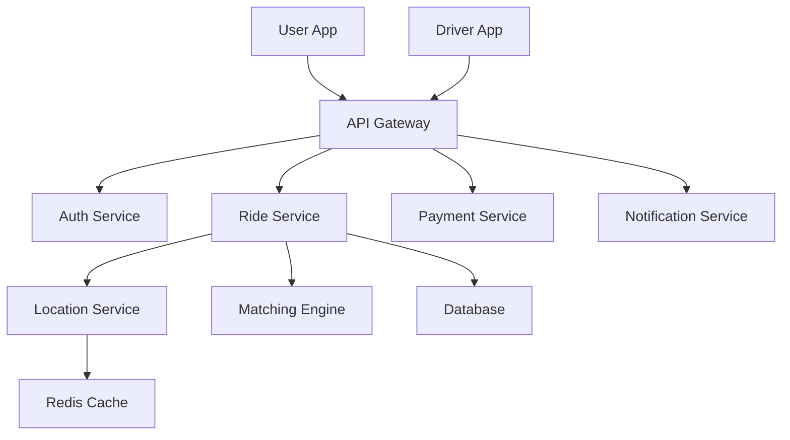
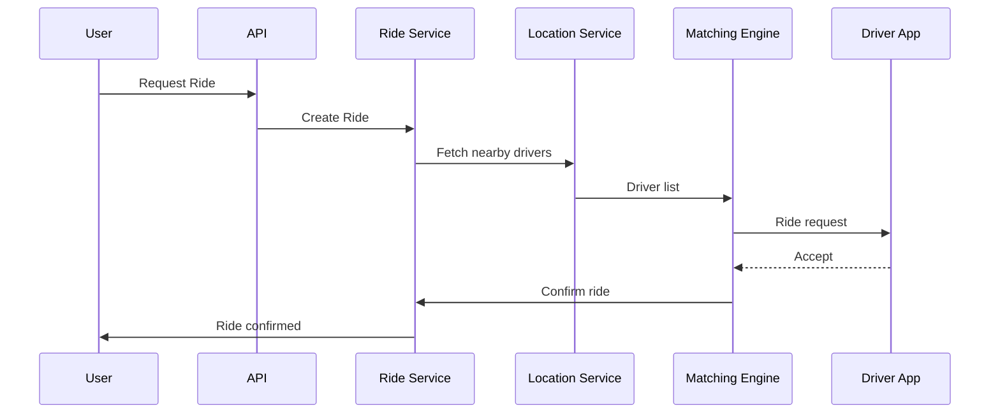
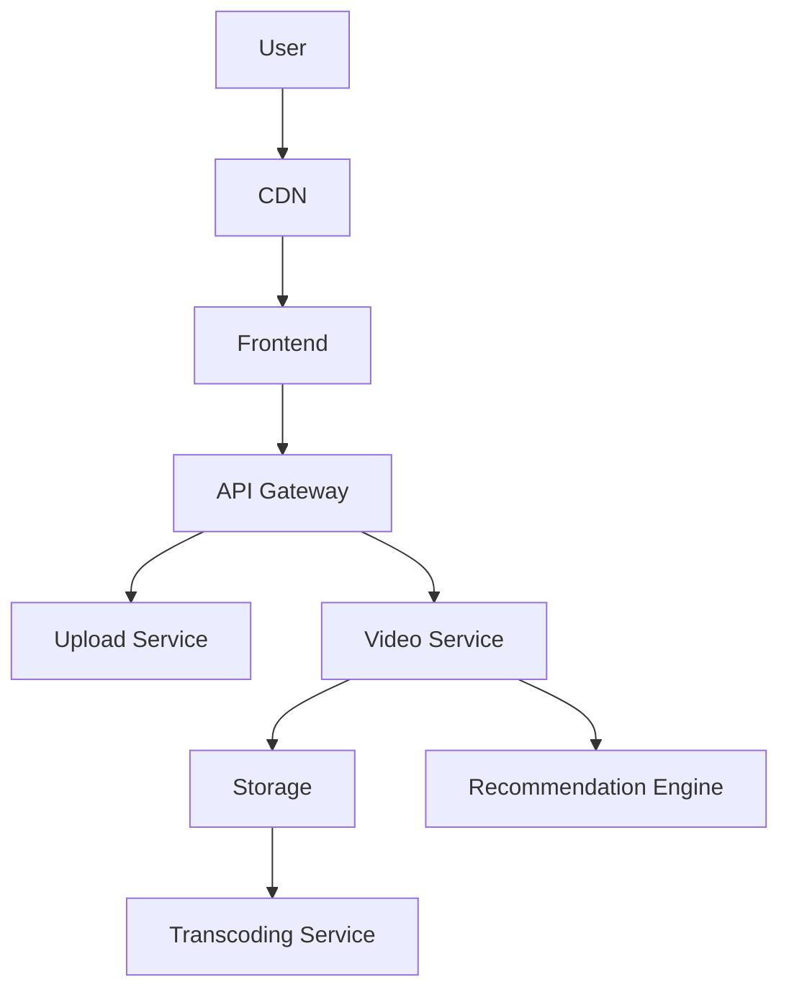
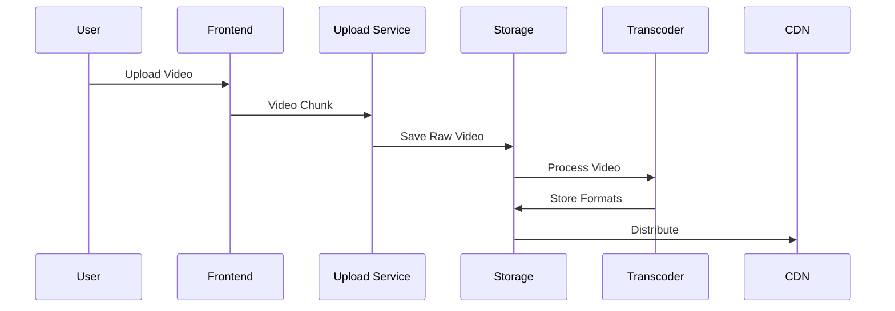
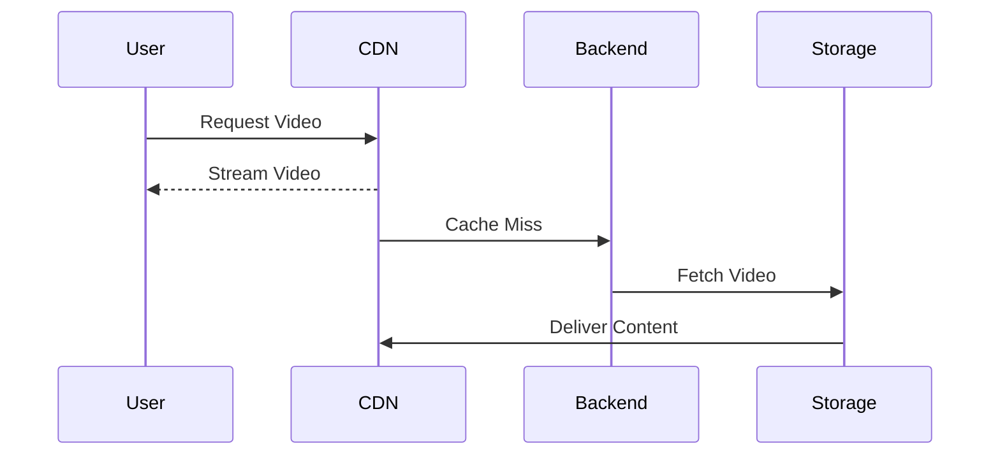
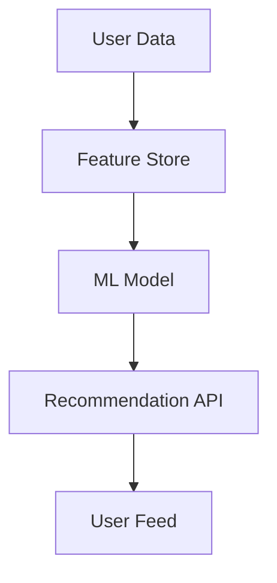

# SYSTEM DESIGN CASE STUDIES

## Uber & YouTube (Production-Grade Analysis)

---

# TABLE OF CONTENTS

1. Overview
2. Uber System Design

   * Requirements
   * Architecture
   * Core Components
   * Data Flow
   * Matching Algorithm
   * Scaling Challenges
   * Failure Handling
3. YouTube System Design

   * Requirements
   * Architecture
   * Video Upload Flow
   * Video Streaming Flow
   * Recommendation System
   * Storage Strategy
   * Scaling & Optimization
4. Advanced Design Considerations
5. Summary Comparison

---

# 1. OVERVIEW

These case studies focus on:

* Real-world scalability
* High availability
* Low latency
* Fault tolerance
* Distributed system design

They are structured to match **FAANG interview expectations** and **production architecture standards**.

---

# 2. UBER SYSTEM DESIGN

## 2.1 FUNCTIONAL REQUIREMENTS

* User requests ride
* Driver accepts ride
* Real-time location tracking
* Fare calculation
* Payments
* Ratings

## 2.2 NON-FUNCTIONAL REQUIREMENTS

* Low latency (<200ms)
* High availability
* Real-time updates
* Horizontal scalability
* Fault tolerance

---

## 2.3 HIGH-LEVEL ARCHITECTURE

---

## 2.4 CORE COMPONENTS

### 1. API Gateway

* Authentication
* Rate limiting
* Routing
* Request validation

### 2. Ride Service

* Ride creation
* Status management
* Trip lifecycle

### 3. Location Service

* Real-time GPS updates
* Geo-indexing
* Driver proximity search

### 4. Matching Engine

* Finds nearest driver
* Considers:

  * Distance
  * Availability
  * Driver rating
  * ETA

---

## 2.5 MATCHING FLOW

---

## 2.6 DATA STORAGE STRATEGY

| Data             | Storage        |
| ---------------- | -------------- |
| User Profiles    | SQL            |
| Trip History     | SQL            |
| Driver Locations | Redis          |
| Analytics        | Data Warehouse |

---

## 2.7 SCALING STRATEGY

### Horizontal Scaling

* Stateless services
* Load balancers
* Auto-scaling groups

### Caching

* Redis for:

  * Active rides
  * Driver locations

### Geo-Sharding

* Partition data by city/region

---

## 2.8 FAILURE HANDLING

| Failure          | Solution         |
| ---------------- | ---------------- |
| Driver drops     | Reassign driver  |
| Service crash    | Retry + fallback |
| Payment failure  | Retry + wallet   |
| Location failure | Cached GPS       |

---

## 2.9 BOTTLENECKS & SOLUTIONS

| Problem         | Solution        |
| --------------- | --------------- |
| High latency    | Geo-replication |
| Hot partitions  | Sharding        |
| Driver overload | Throttling      |
| Surge demand    | Dynamic pricing |

---

# 3. YOUTUBE SYSTEM DESIGN

---

## 3.1 FUNCTIONAL REQUIREMENTS

* Upload videos
* Store videos
* Stream videos
* Recommend content
* Handle comments & likes

## 3.2 NON-FUNCTIONAL REQUIREMENTS

* Massive scalability
* High availability
* Low latency streaming
* Global delivery
* Fault tolerance

---

## 3.3 HIGH-LEVEL ARCHITECTURE

---

## 3.4 VIDEO UPLOAD FLOW

---

## 3.5 VIDEO STREAMING FLOW

---

## 3.6 STORAGE DESIGN

| Component      | Purpose         |
| -------------- | --------------- |
| Object Storage | Video files     |
| CDN            | Fast delivery   |
| Metadata DB    | Video info      |
| Cache          | Trending videos |

---

## 3.7 RECOMMENDATION SYSTEM

### Inputs:

* Watch history
* Likes
* Search history
* Watch time
* User preferences

### Architecture:

---

## 3.8 SCALING STRATEGIES

### Video Storage

* Chunked uploads
* Distributed storage
* Replication

### Streaming

* CDN edge caching
* Adaptive bitrate streaming

### Backend

* Microservices
* Horizontal scaling

---

## 3.9 FAILURE HANDLING

| Issue          | Solution      |
| -------------- | ------------- |
| Upload failure | Resume upload |
| High traffic   | CDN cache     |
| Server crash   | Auto failover |
| Data loss      | Replication   |

---

# 4. ADVANCED SYSTEM DESIGN CONCEPTS

## Event-Driven Architecture

* Kafka / PubSub
* Asynchronous processing

## Circuit Breakers

* Prevent cascading failures

## Rate Limiting

* Protect services

## Backpressure Handling

* Queue-based buffering

---

# 5. COMPARISON SUMMARY

| Aspect         | Uber               | YouTube       |
| -------------- | ------------------ | ------------- |
| Core Challenge | Real-time matching | Massive scale |
| Latency        | Ultra-low          | Moderate      |
| Storage        | Transactional      | Media-heavy   |
| Scaling        | Geo-based          | Global CDN    |
| Architecture   | Event-driven       | Distributed   |

---

# 6. INTERVIEW TAKEAWAYS

✔ Always clarify requirements
✔ Think in components
✔ Design for scale
✔ Handle failures
✔ Explain trade-offs
✔ Use diagrams
✔ Optimize gradually

---

# 7. FINAL NOTE

This document represents:

* FAANG-level system design
* Real-world production architecture
* Interview-ready explanations
* Engineering best practices

---
