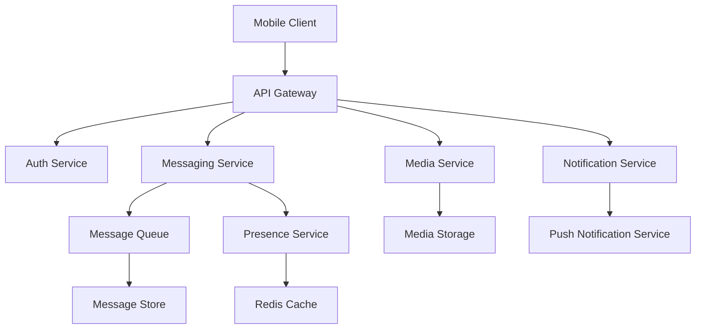
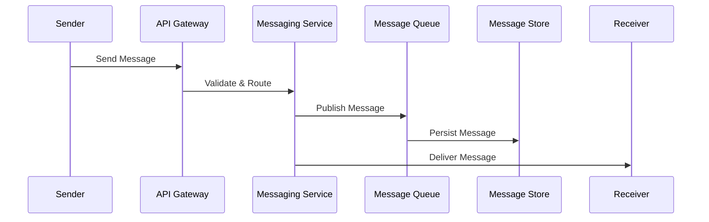
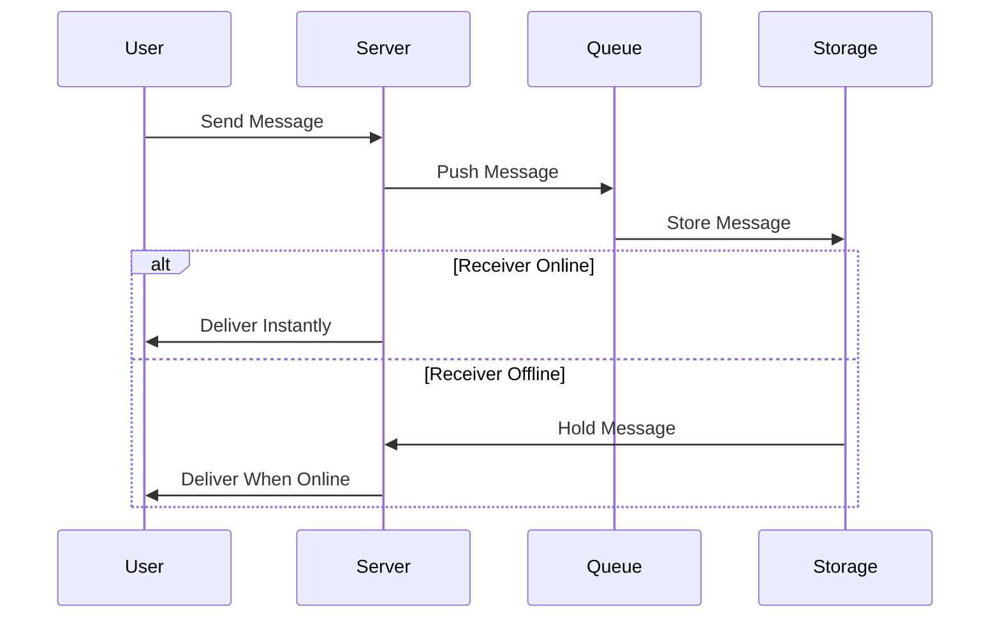
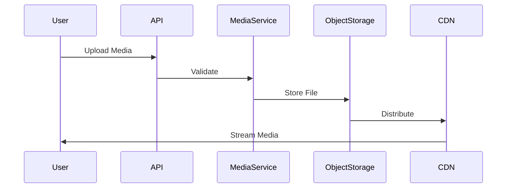
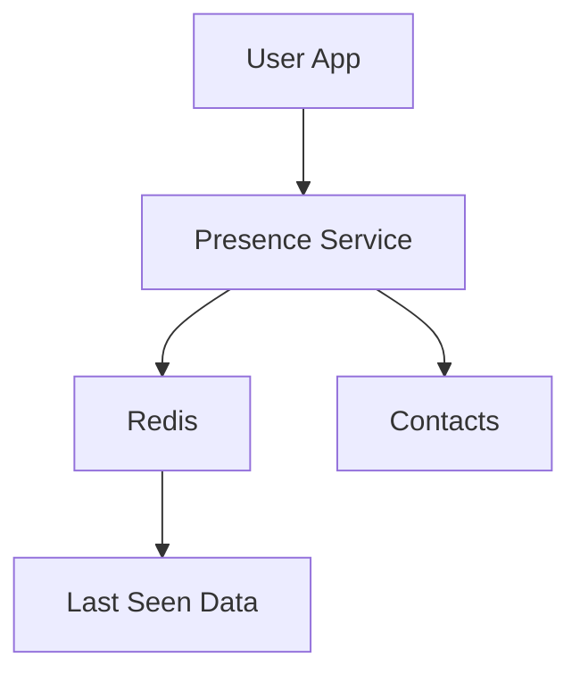
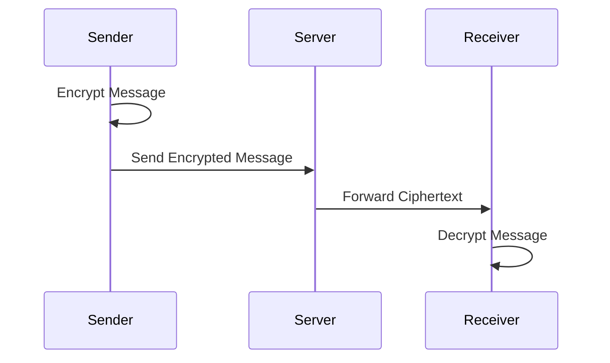
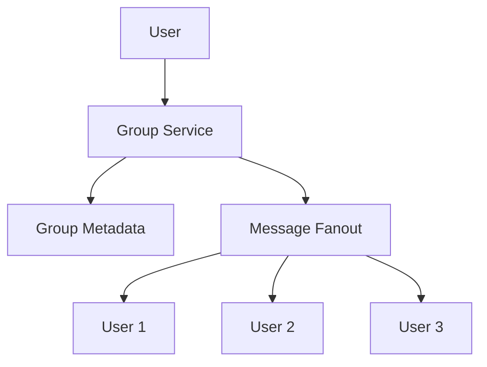
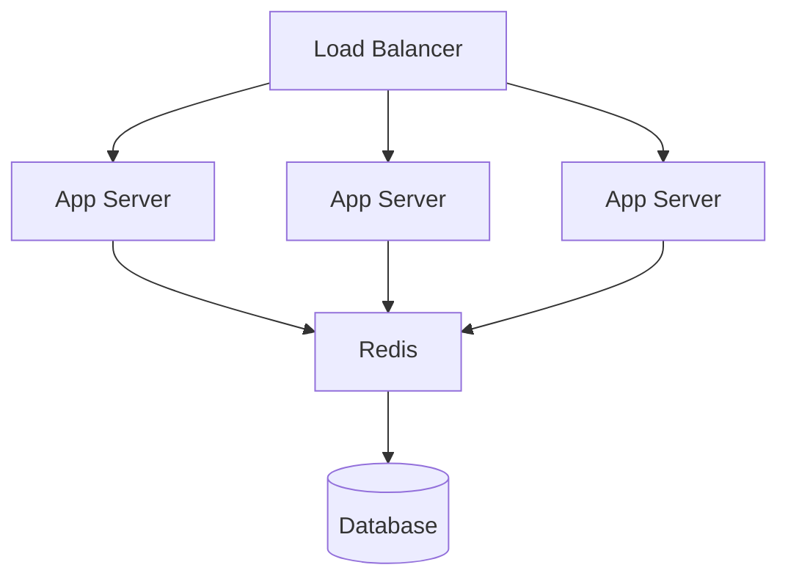
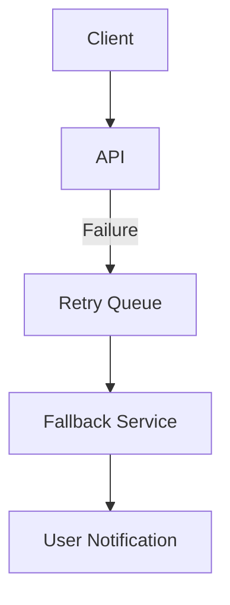

# 📘 WhatsApp System Design — Mermaid Diagrams

---

## 1. High-Level Architecture

---

## 2. Message Sending Flow (Text Message)

---

## 3. Message Delivery with Offline Support

---

## 4. Media Upload & Delivery Flow

---

## 5. Presence System (Online / Offline)

---

## 6. End-to-End Encryption Flow

✔ Server never reads message content
✔ Keys exist only on user devices

---

## 7. Group Messaging Architecture

---

## 8. Scalability Architecture

---

## 9. Failure Handling Design

---

## 10. WhatsApp System Design Summary

| Component         | Purpose            |
| ----------------- | ------------------ |
| API Gateway       | Entry point        |
| Messaging Service | Message routing    |
| Queue             | Async processing   |
| Redis             | Presence + caching |
| Object Storage    | Media              |
| CDN               | Fast delivery      |
| Encryption        | Privacy            |
| Load Balancer     | Scaling            |

---

## 11. Key Design Principles Used

✔ Event-driven architecture
✔ Asynchronous processing
✔ Horizontal scalability
✔ Fault tolerance
✔ Low-latency delivery
✔ Strong encryption
✔ Geo-distributed systems

---

## 12. Interview-Ready Talking Points

* Why WhatsApp uses **message queues**
* How **fan-out** works for groups
* Why **Redis** is critical
* Why **CDN** is needed
* How WhatsApp achieves **low latency**
* How **end-to-end encryption** works
* Handling **millions of concurrent users**

---

## 13. Final Note

This architecture supports:

* Billions of messages/day
* Millions of concurrent users
* Near-zero latency delivery
* High fault tolerance
* Secure communication

---
